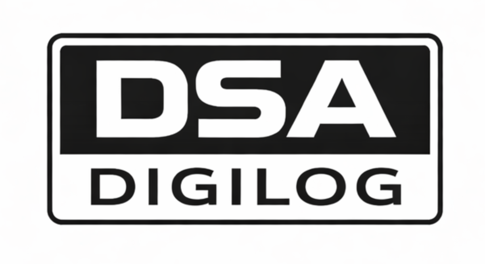

# DSA — Digilog Scalable Audio Format Specification

  

**DSA is an open audio codec format designed for physical printed media and real-time motion-based playback.**

> Part of the [Digilog](https://github.com/pisdronio/digilog-spec) open physical audio format.

---

## This repository

This repository contains the **normative format specification** and **research documentation** for DSA. It is licensed under [CC BY-SA 4.0](LICENSE) — you are free to implement, adapt, and build on this specification as long as you credit the source and share derivatives under the same license.

| File | Contents |
|------|----------|
| [`SPEC.md`](SPEC.md) | Normative implementor specification — MUST/SHOULD requirements, bitstream layout, all constants |
| [`RESEARCH.md`](RESEARCH.md) | Scientific documentation — theory, design decisions, benchmarks, future directions |

---

## Reference implementation

The reference implementation of DSA is maintained separately under GPL v3:

**[github.com/pisdronio/dsa](https://github.com/pisdronio/dsa)**

It includes:
- MDCT frame analyzer, perceptual quantizer, K/B-frame encoders
- Huffman entropy coder, layered bitstream packer
- Decoder with reverse playback, variable speed, and analog degradation
- Digilog disc encoder interface
- Unified CLI, benchmark suite, test suite (74 tests)

---

## What DSA is

DSA is an audio codec built for a specific purpose: encoding audio into a physical printed medium playable by scanning with a camera — including in real time while the medium is in motion (spinning on a turntable, scratched by a DJ, hand-scanned across a surface).

### What makes DSA different

| Property | MP3 / AAC / Opus | DSA |
|---|---|---|
| Designed for physical media | No | Yes |
| Layered scalable decoding | No | Yes |
| Native reverse playback | No | Yes |
| Motion-aware (variable speed) | No | Yes |
| Graceful analog degradation | No | Yes |
| Maps to physical disc rings | No | Yes |

### Core architecture

- **Transform:** MDCT, N=2048, M=1024, sine window, 238 dB TDAC SNR
- **Frame structure:** GOP=8, K-frames (self-contained) + B-frames (bidirectional)
- **Layers:** L0 (8 bands, 20–800 Hz), L1 (16 bands, 800–6 kHz), L2 (24 bands, 6–22 kHz)
- **Entropy coding:** Huffman with per-layer tables
- **Bitstream:** DSA1 format, CRC32, two encoding modes (discrete / gradient)

---

## License

This specification is licensed under **Creative Commons Attribution-ShareAlike 4.0 International**.

See [LICENSE](LICENSE) or https://creativecommons.org/licenses/by-sa/4.0/

The reference implementation is licensed separately under **GPL v3**.

---

## Related

- [digilog-spec](https://github.com/pisdronio/digilog-spec) — the Digilog physical format specification
- [dsa](https://github.com/pisdronio/dsa) — DSA reference implementation (GPL v3)

---

*Scan the groove.*
